МИНИСТЕРСТВО НАУКИ И ВЫСШЕГО ОБРАЗОВАНИЯ РОССИЙСКОЙ ФЕДЕРАЦИИ
Федеральное государственное автономное образовательное учреждение высшего образования
"КРЫМСКИЙ ФЕДЕРАЛЬНЫЙ УНИВЕРСИТЕТ им. В. И. ВЕРНАДСКОГО"
ФИЗИКО-ТЕХНИЧЕСКИЙ ИНСТИТУТ
Кафедра компьютерной инженерии и моделирования
  
​
### Отчёт по лабораторной работе № 1  по дисциплине "Программирование"
 
​
студента 1 курса группы 191(1)
Дегтярева Артура Руслановича
направления подготовки 09.03.04 "Программная Инженерия"
 
​
<table>
<tr><td>Научный руководитель  старший преподаватель кафедры  компьютерной инженерии и моделирования</td>
<td>(оценка)</td>
<td>Чабанов В.В.</td>
</tr>
</table>
  
​
Симферополь, 2019

### Цель: Научиться работать с интерфейсом Visual Studio.

### 1 Как создать консольное приложение C++

Создание проекта - Консольное приложение - Создать

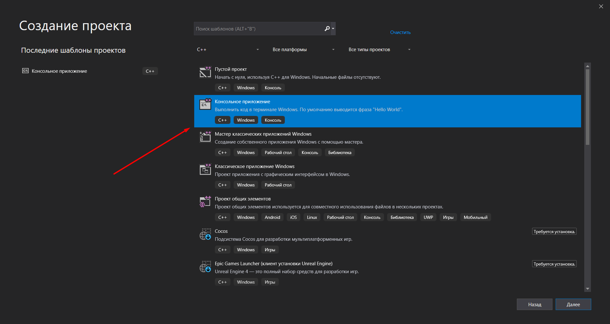

*Рис.1 Создание консольного приложения*

### 2 Как изменить цветовую схему (оформление) среды

Средства - Параметры - Цветовая тема

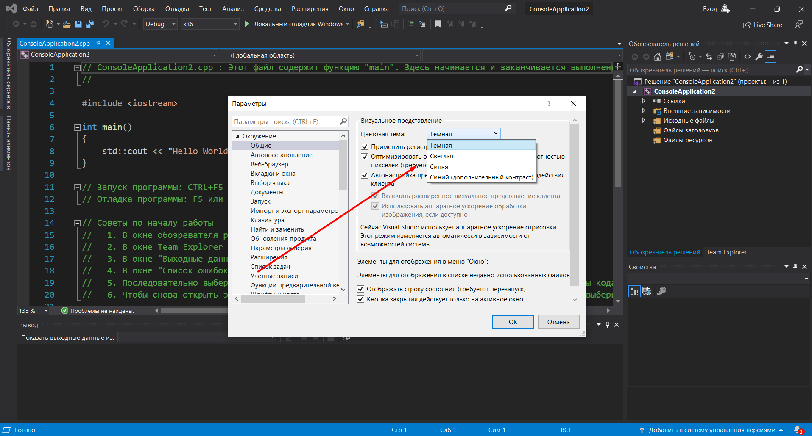

*Рис.2 Изменение цветовой схемы*

### 3 Как закомментировать/раскомментировать блок кода средствами VS

Для того чтобы закомментировать блок кода нужно нажать сочетание клавиш Ctrl+K+Ctrl+C, расскоментировать - Ctrl+K+Ctrl+U

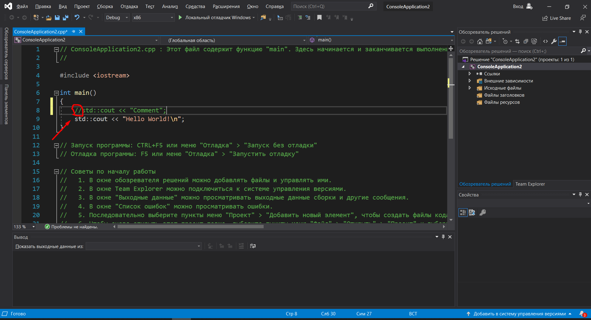

*Рис.3 Комментирование блока када*

### 4 Как открыть в проводнике Windows папку с проектом средствами VS
Нажатием правой кнопкой мыши по приложению справа от кода -> Открыть папку в проводнике

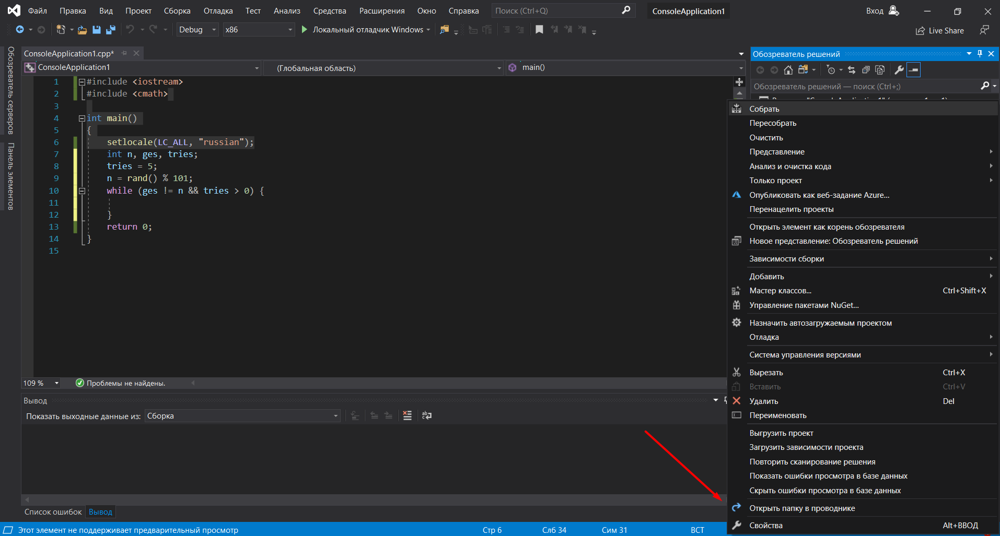

*Рис.4 Открытие папки с проектом*

### 5 Какое расширение файла-проекта используется в VS

.vcxproj

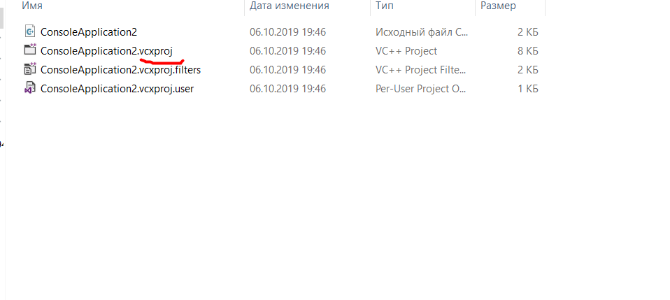

*Рис. 5 Расширение файла-проекта*

### 6 Как запустить код без отладки (не менее 2 способов)

1.Отладка - Запуск без отладки

2. CTRL+F5

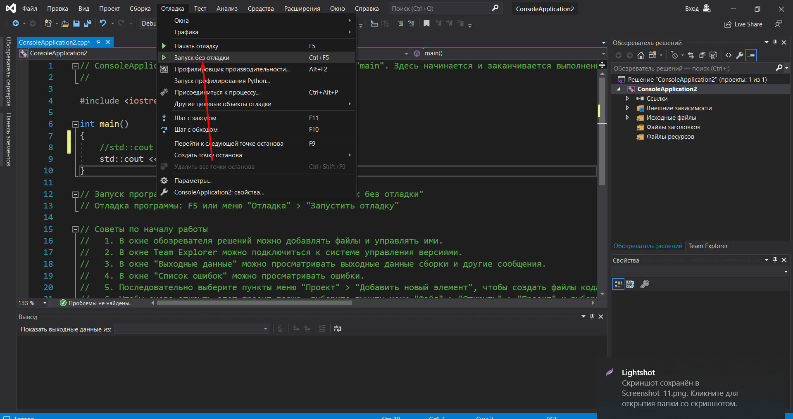

*Рис.6 Запуск кода без отладки*

### 7 Как запустить код в режиме отладки (не менее 2 способов)

1. Отладка - Начать отладку 

2. F5

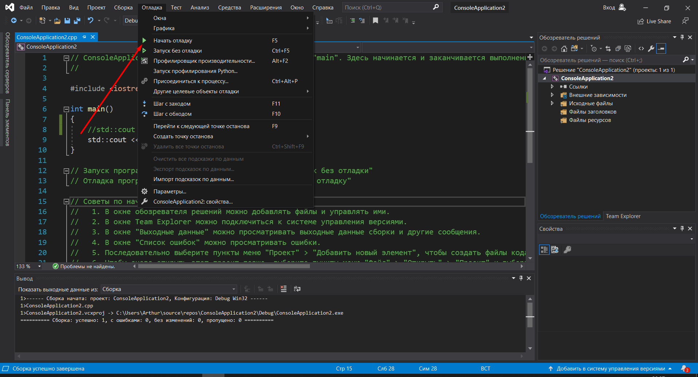

*Рис.7 Запуск кода в режиме отладки*

### 8 Как установить/убрать точку останова (breakpoint)

Нажатием на панель слева от кода

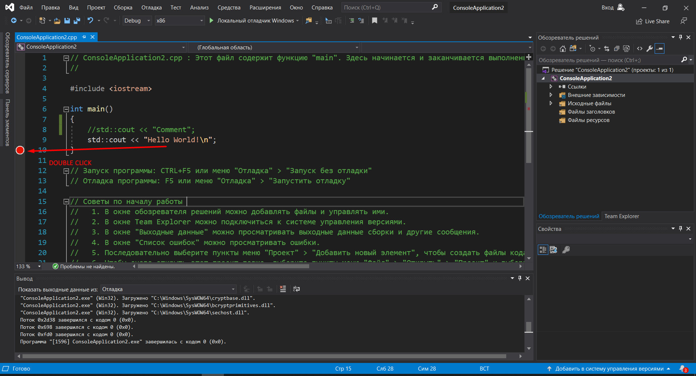

*Рис.8 Установка точки остановы*

### 9 Создайте программу со следующим кодом

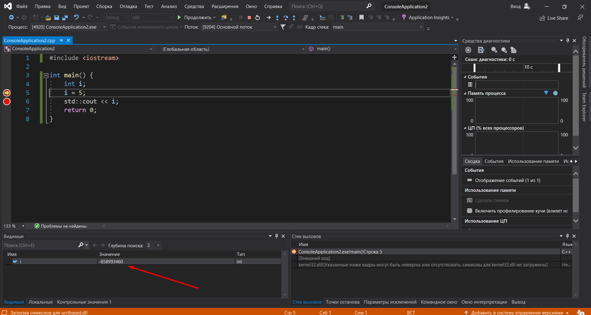

*Рис.9 Значение переменной на 5 строке*

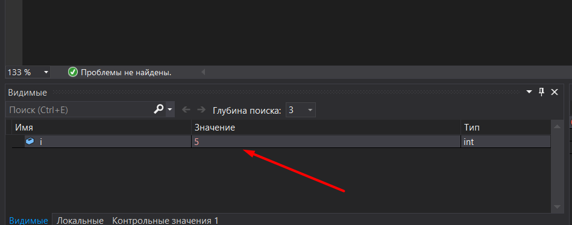

*Рис.10 Значение переменной на 6 строке*

### 10 Выполните задание 9 изменив программу на следующую
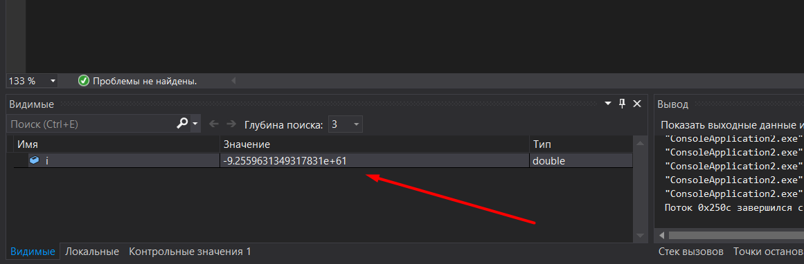

*Рис.11 Значение переменной на 5 строке*

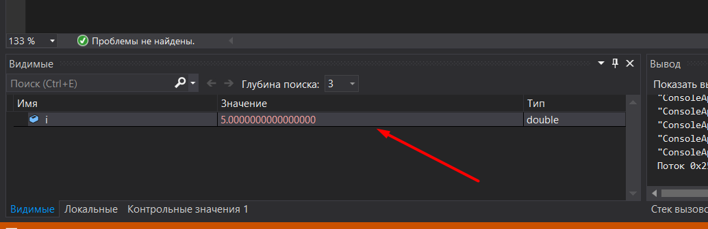

*Рис.12 Значение переменной на 6 строке*

### Вывод: в ходе лабороторной работы мы освоили базовые навыки работы с Visual Studio
