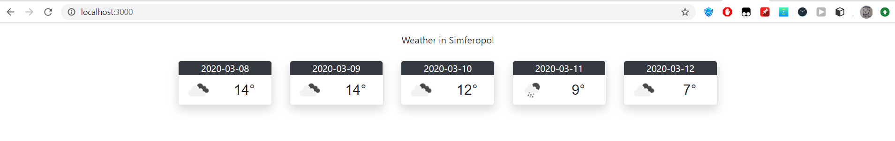

МИНИСТЕРСТВО НАУКИ И ВЫСШЕГО ОБРАЗОВАНИЯ РОССИЙСКОЙ ФЕДЕРАЦИИ\
Федеральное государственное автономное образовательное учреждение высшего образования\
"КРЫМСКИЙ ФЕДЕРАЛЬНЫЙ УНИВЕРСИТЕТ им. В. И. ВЕРНАДСКОГО"\
ФИЗИКО-ТЕХНИЧЕСКИЙ ИНСТИТУТ\
Кафедра компьютерной инженерии и моделирования\
<br/><br/>
​
### Отчёт по лабораторной работе № 6<br/> по дисциплине "Программирование"
<br/>

студента 1 курса группы ПИ-б-о-191(1)\
Дегтярева Артура Руслановича\
направления подготовки 09.03.04 "Программная инженерия"\
<br/>
​
<table>
<tr><td>Научный руководитель<br/> старший преподаватель кафедры<br/>компьютерной инженерии и моделирования</td>
<td>(оценка)</td>
<td>Чабанов В.В.</td>
</tr>
</table>
<br/><br/>
​
Симферополь, 2019


### Цель: 
* Закрепить навыки разработки многофайловыx приложений;
* Изучить способы работы с API web-сервиса;
* Изучить процесс сериализации/десериализации данных.

#### Ход работы

    API ключ от openweathermap.org: 53c6e39cf3ee11a1d7549ffea83d6bd8    

Полученный код программы

```cpp
#include <iostream>
#include <httplib/httplib.h>
#include <nlohmann/json.hpp>
#include <fstream>
#include <string>
#include <vector>

char host[] = "api.openweathermap.org";
char simf_weather[] = "/data/2.5/forecast?q=Simferopol&appid=53c6e39cf3ee11a1d7549ffea83d6bd8&units=metric";

struct Forecast {
	std::string date;
	std::string weather;
	int temp;
};

void replace(std::string& html, std::string init, std::string final) {
	int init_index = html.find(init);
	html.erase(init_index, init.size());
	html.insert(init_index, final);
}

void replace(std::string& html, std::string init, int final) {
	std::string final_str = std::to_string(final);
	int init_index = html.find(init);
	html.erase(init_index, init.size());
	html.insert(init_index, final_str);
}

void gen_response(const httplib::Request& req, httplib::Response& res) {
	httplib::Client cli(host, 80);
	std::string w_temp;
	std::fstream fin;
	std::vector<Forecast> parsedData;
	fin.open("informer_template.html");
	if (!fin.is_open()) {
		std::cout << "Error" << std::endl;
	}
	else {
		char ch;
		while (fin.get(ch)) {
			w_temp += ch;
		}
	}
	auto result = cli.Get(simf_weather);
		nlohmann::json json_weather = nlohmann::json::parse(result->body);
		for (int i = 0; i < 30; i++) {
			std::string temp_date = json_weather.at("list")[i].at("dt_txt");
			std::string date = temp_date.substr(0, 11);
			bool flag = false;
			for (size_t j = 0; j < parsedData.size(); j++) {
				if (parsedData[j].date == date) {
					flag = true;
					break;
				}
			}
			if (flag) {
				continue;
			}
			else if (parsedData.size() < 5) {
				Forecast element;
				element.date = date;
				element.weather = json_weather.at("list")[i].at("weather")[0].at("icon");
				element.temp = json_weather.at("list")[i].at("main").at("temp");
				parsedData.push_back(element);
			}
		}
		std::string city = json_weather.at("city").at("name");
		replace(w_temp, "{city.name}", city);
		for (size_t i = 0; i < parsedData.size(); i++) {
			replace(w_temp, "{list.dt}", parsedData[i].date);
			replace(w_temp, "{list.weather.icon}", parsedData[i].weather);
			replace(w_temp, "{list.main.temp}", parsedData[i].temp);
	}
	res.set_content(w_temp, "text/html");
	fin.close();
}

int main() {
	httplib::Server svr;                    
	svr.Get("/", gen_response);   
	svr.listen("localhost", 3000); 
}

```


*Рис.1 Результат работы программы*


#### Вывод

В ходе лабораторной работы я закрепил навыки разработки многофайловыx приложений,изучил способы работы с API web-сервиса, изучил процесс сериализации/десериализации данных, получил опыт работы с JSON файлами, а также закрепил навыки чтения/записи файлов.
