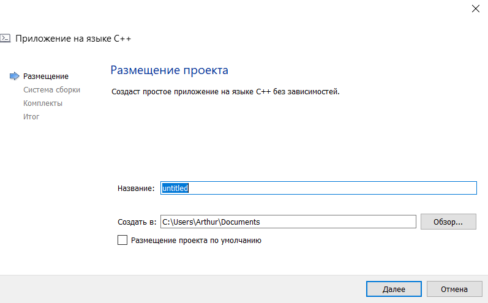
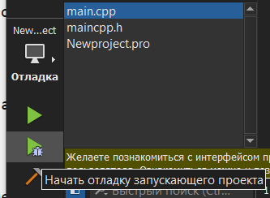
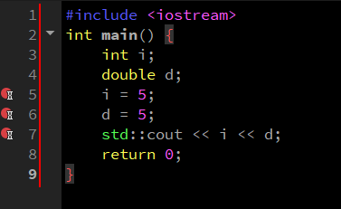

МИНИСТЕРСТВО НАУКИ И ВЫСШЕГО ОБРАЗОВАНИЯ РОССИЙСКОЙ ФЕДЕРАЦИИ\
Федеральное государственное автономное образовательное учреждение высшего образования\
"КРЫМСКИЙ ФЕДЕРАЛЬНЫЙ УНИВЕРСИТЕТ им. В. И. ВЕРНАДСКОГО"\
ФИЗИКО-ТЕХНИЧЕСКИЙ ИНСТИТУТ\
Кафедра компьютерной инженерии и моделирования\
  
​
### Отчёт по лабораторной работе № 7  по дисциплине "Программирование"
 

студента 1 курса группы ПИ-б-о-191(1)\
Дегтярева Артура Руслановича\
направления подготовки 09.03.04 "Программная инженерия"\
 
​
<table>
<tr><td>Научный руководитель  старший преподаватель кафедры компьютерной инженерии и моделирования</td>
<td>(оценка)</td>
<td>Чабанов В.В.</td>
</tr>
</table>
  
​
Симферополь, 2019

### Цель: изучить основные возможности создания и отладки программ в IDE Qt Creator

#### Ход работы

    1.Как создать консольное приложение С++ в IDE Qt Creator без использования компонентов Qt?

Файл - Создать файл или проект...

*Рис.1 Создаем проект*

Проект без Qt - Приложение на языке C++

*Рис.2 Создаем приложение на C++*

Вводим название проекта и расположение, а также другие настройки проекта

*Рис.3. Вводим название и выбираем расположение проекта*

    2.Как изменить цветовую схему (оформление) среды?

Нажимаем Инструменты - Параметры 

*Рис.4 Открываем параметры*

Открываем вкладку Среда - Тема, нажимаем применить и перезапускаем Qt Creator

*Рис.5 Меняем тему*

    3.Как закомментировать/раскомментировать блок кода средствами Qt Creator?

Нажатием Ctrl+/ 

*Рис.6 Результат нажатия Ctrl+/*

    4.Как открыть в проводнике Windows папку с проектом средствами Qt Creator?

Нажимаем ПКМ по файлу проекта - Показать в проводнике

*Рис.7 Открываем проект в проводнике*

    5.Какое расширение файла-проекта используется Qt Creator?

Qt Creator использует расширение .pro

*Рис.8 Расширение проекта*

    6.Как запустить код без отладки?

Нажимаем зеленую стрелку без жука, или Ctrl+R

*Рис.9 Запускаем отладку*

Либо нажимаем Сборка - Запустить

*Рис.10 Запускаем отладку другим способом*

    7.Как запустить код в режиме отладки?

Нажимаем на стрелку с жуком

*Рис.11 Запускаем отладку с помощью стрелки*

Либо нажимаем Отладка - Начать отладку - Начать отладку запускающего проекта

*Рис.12 Запускаем отладку с помощью вкладки отладка*

    8.Как установить/убрать точку останова (breakpoint)?

Нужно нажать на пустое место слева от номера строки либо клавишу F9

*Рис.13 Устанавливаем точку остановы*

    9.Создадим приложение

*Рис.14 Переключаем в конфигурацию сборки "Отладка"*

*Рис.15 Поставим точки остановы на 5,6,7 строках*

Запустим отладку и будем отслеживать значения переменных

*Рис.16 Значение i на 5 строке *

*Рис.17 Значение d на 6 строке*

*Рис.18 Значение i и d на 7 строке *

Полученные значение не совпадают с тем, что мы получали в MSVS, в последнем переменные изначально заполнялись мусором.

    10.Работа с примерами в Qt Creator

Запустим сборку проекта Calculator Form Example

*Рис.19 Сборка примера*

Перейдем в файл main.cpp и нажмем F1 на функции calculator.show()

*Рис.20 Функция их main.cpp*

При нажатии F1 открывается справка об этой функции

*Рис.21 Справка о функции show()*

Заходим в Формы - calculatorform.ui 

*Рис.22 Дизайн проекта Calculator Form Example*

Изменим английский текст на русский

*Рис.23 Изменяем текст*

*Рис.24 Пересобираем проект* 

#### Вывод

В ходе лабораторной работы я изучил основные возможности создания и отладки программ,узнал как правильно работать с проектами в IDE Qt Creator.  
