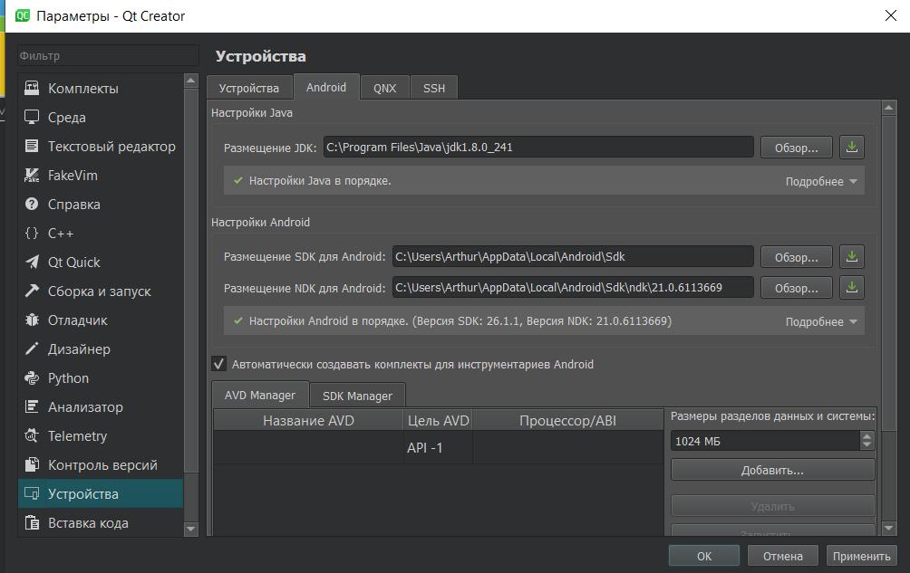
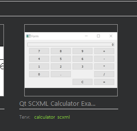
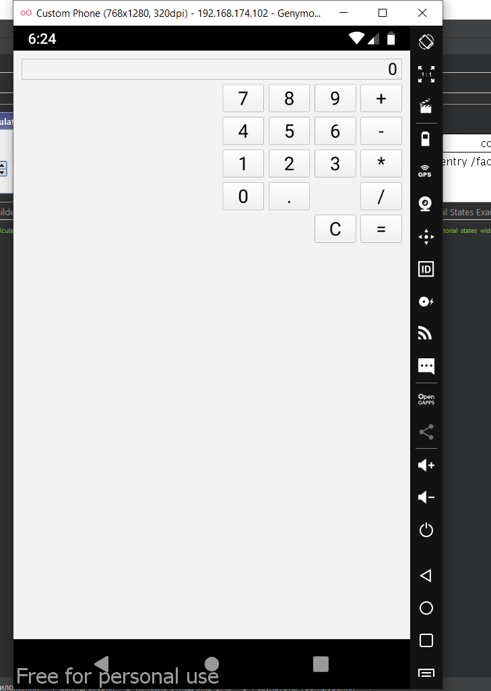

МИНИСТЕРСТВО НАУКИ И ВЫСШЕГО ОБРАЗОВАНИЯ РОССИЙСКОЙ ФЕДЕРАЦИИ\
Федеральное государственное автономное образовательное учреждение высшего образования\
"КРЫМСКИЙ ФЕДЕРАЛЬНЫЙ УНИВЕРСИТЕТ им. В. И. ВЕРНАДСКОГО"\
ФИЗИКО-ТЕХНИЧЕСКИЙ ИНСТИТУТ\
Кафедра компьютерной инженерии и моделирования\
  
​
### Отчёт по лабораторной работе № 8  по дисциплине "Программирование"
 

студента 1 курса группы ПИ-б-о-191(1)\
Дегтярева Артура Руслановича\
направления подготовки 09.03.04 "Программная инженерия"\
 
​
<table>
<tr><td>Научный руководитель  старший преподаватель кафедры компьютерной инженерии и моделирования</td>
<td>(оценка)</td>
<td>Чабанов В.В.</td>
</tr>
</table>
  
​
Симферополь, 2019

### Цель: 
### 1.Настроить IDE Qt Creator для разработки приложений под android ОС;
### 2.Изучить базовые понятия связанные с мобильной разработкой;
### 3.Научиться создавать мобильные приложения при помощи фреймворка Qt 5.14.

#### Ход работы

В ходе выполнения лабораторной работы я установил все необходимые компоненты фреймворка Qt 5.14 для android, jdk, android studio. Настроил Qt Creator для запуска приложений под Android. Также скачал и установил эмулятор Genymotion для тестирования программ на Android устройствах.

*Рис.1. Успешно настроенный для работы с Android Qt*

В качестве проекта я выбрал проект-калькулятор с названием "Qt SCXML Calculator Example" 

*Рис.2. Тестируемый проект*

После чего я собрал и запустил проект на эмуляторе

*Рис.3. Собранный проект*

#### Вывод

В ходе лабораторной работы я настроил Qt Creator для работы с проектами под Android, изучил базовые понятия, связанные с мобильной разработкой, понял как создавать мобильные приложения с помощью фреймворка Qt 5.14, собрал и запустил первый проект на эмуляторе.
