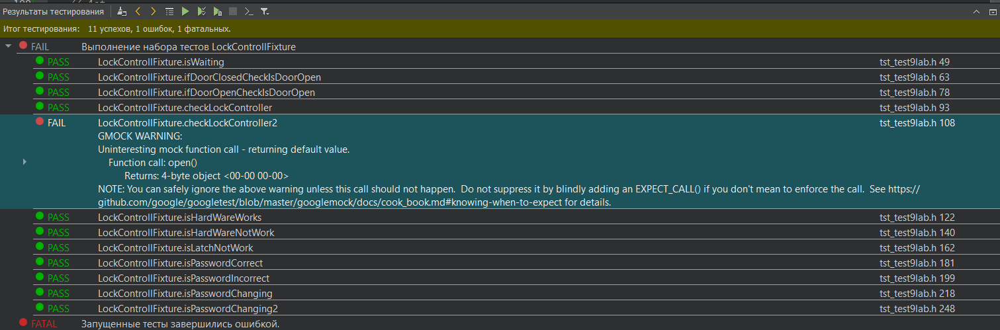
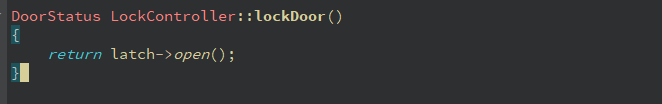
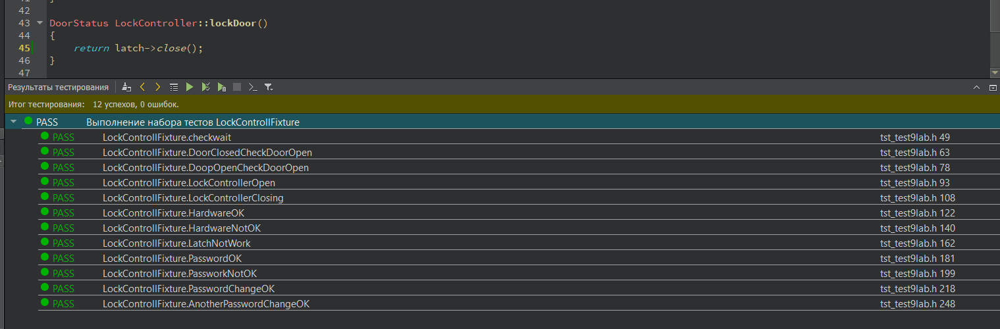

МИНИСТЕРСТВО НАУКИ И ВЫСШЕГО ОБРАЗОВАНИЯ РОССИЙСКОЙ ФЕДЕРАЦИИ\
Федеральное государственное автономное образовательное учреждение высшего образования\
"КРЫМСКИЙ ФЕДЕРАЛЬНЫЙ УНИВЕРСИТЕТ им. В. И. ВЕРНАДСКОГО"\
ФИЗИКО-ТЕХНИЧЕСКИЙ ИНСТИТУТ\
Кафедра компьютерной инженерии и моделирования\
  
​
### Отчёт по лабораторной работе № 9  по дисциплине "Программирование"
 

студента 1 курса группы ПИ-б-о-191(1)\
Дегтярева Артура Руслановича\
направления подготовки 09.03.04 "Программная инженерия"\
 
​
<table>
<tr><td>Научный руководитель  старший преподаватель кафедры компьютерной инженерии и моделирования</td>
<td>(оценка)</td>
<td>Чабанов В.В.</td>
</tr>
</table>
  
​
Симферополь, 2019

### Цель: 
### 1.Познакомиться с Google Test и Google Mock Framework;
### 2.Изучить базовые понятия относящийся к тестированию кода;
### 3.Научиться тестировать классы в среде разработки Qt Creator.

#### Ход работы

Готовый тестовый проект: [Тестовый проект](./)

После запуска тестов я получил вот такой результат:

*Рис.1. Результаты тестирования*

Пятый тест прошел с ошибкой и разобравшись в коде, я понял, что ошибка возникает из-за неправильной реализации метода lockDoor(). Метод должен возвращать latch->close(), а возвращает latch->open().

*Рис.2. Неправильная реализация метода*

При правильной реализации, все тесты проходят без ошибок.

*Рис.3. Собранный проект*

Данная ошибка могла возникнуть из-за банальной невнимательности программиста

#### Вывод

В ходе лабораторной работы я познакомился с Google Test и Google Mock Framework,
изучил базовые понятия относящийся к тестированию кода и научился тестировать классы в среде разработки Qt Creator.
