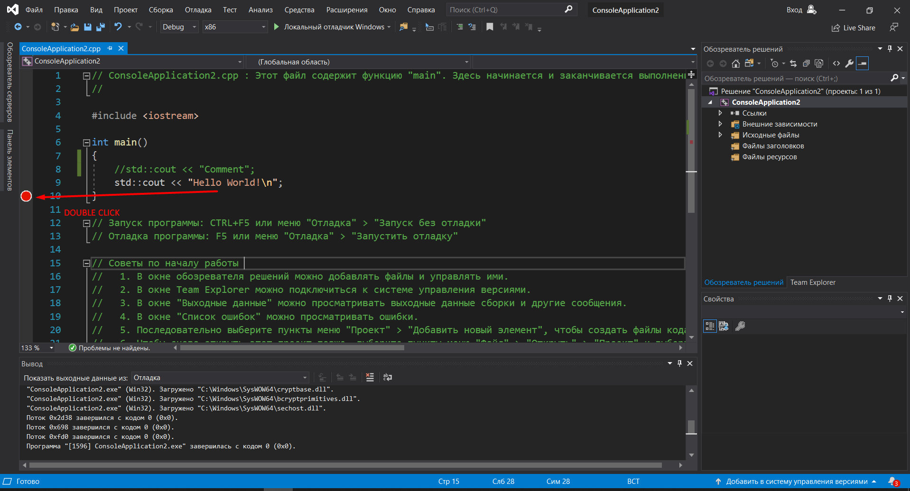

МИНИСТЕРСТВО НАУКИ  И ВЫСШЕГО ОБРАЗОВАНИЯ РОССИЙСКОЙ ФЕДЕРАЦИИ  
Федеральное государственное автономное образовательное учреждение высшего образования  
"КРЫМСКИЙ ФЕДЕРАЛЬНЫЙ УНИВЕРСИТЕТ им. В. И. ВЕРНАДСКОГО"  
ФИЗИКО-ТЕХНИЧЕСКИЙ ИНСТИТУТ  
Кафедра компьютерной инженерии и моделирования
  
​
### Отчёт по лабораторной работе № 1  по дисциплине "Программирование"
 
​
студента 1 курса группы 191(1)  
Дегтярева Артура Руслановича 
направления подготовки 09.03.04 "Программная Инженерия"  
 
​
<table>
<tr><td>Научный руководитель  старший преподаватель кафедры  компьютерной инженерии и моделирования</td>
<td>(оценка)</td>
<td>Чабанов В.В.</td>
</tr>
</table>
  
​
Симферополь, 2019

### 1 Как создать консольное приложение C++

Создание проекта - Консольное приложение - Создать

### 2 Как изменить цветовую схему (оформление) среды

Средства - Параметры - Цветовая тема

### 3 Как закомментировать/раскомментировать блок кода средствами VS

Для того чтобы закомментировать блок кода нужно поставить // перед строкой кода либо /* в начале блока кода и */ в конце

### 4 Как открыть в проводнике Windows папку с проектом средствами VS

Файл - Открыть - Решение или проект - Открыть

.png)

### 5 Какое расширение файла-проекта используется в VS

.vcxproj

### 6 Как запустить код без отладки (не менее 2 способов)

1.Отладка - Запуск без отладки

2. CTRL+F5

### 7 Как запустить код в режиме отладки (не менее 2 способов)

1. Отладка - Начать отладку 

2. F5

 

### 8 Как установить/убрать точку останова (breakpoint)

Нажатием на панель слева от кода

### 9 Создайте программу со следующим кодом

### 10 Выполните задание 9 изменив программу на следующую

